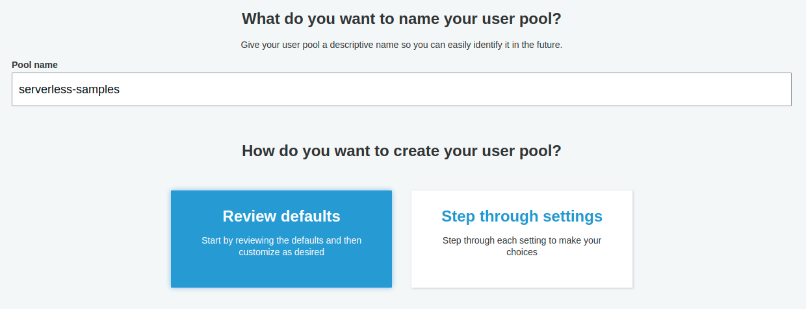
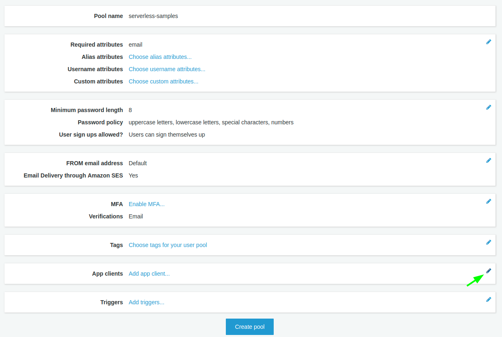
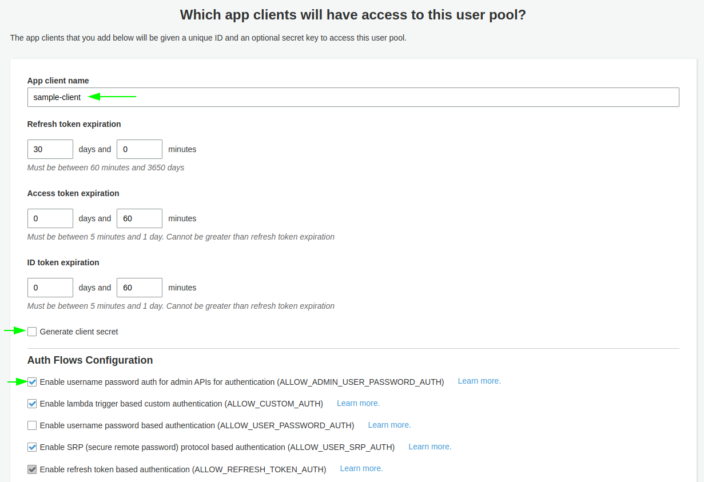

# Serverless Samples: rest-authorizer-cognito

This sample serverless application is a basic example of how to implement a Cognito Authorizer for a REST API. In this sample, tokens are obtained from an AWS Cognito User Pool and the identity token is passed to an API Gateway endpoint to authorize access.

## Prerequisites

The following are required to deploy and run this sample.

* [NVM with Node 14.x (lts/fermium)][nvm]
* [Yarn][yarn]
* [Serverless Framework][sls]

Configure the Serverless framework with [AWS credentials](https://www.serverless.com/framework/docs/providers/aws/guide/credentials/).

## Install

Run the following command in the sample base directory:

```
nvm use

yarn install
```

## Create Cognito User Pool

**Note:** This example assumes that you create a Cognito User Pool with the default configuration except where explicit instructions are provided below. Deviating from this configuration may cause the *CLI commands* in subsequent steps of this guide to fail.

Log into the AWS Console and go to the Cognito service. Select *Manage User Pools* and click the button to *Create a user pool*.



Give your User Pool a name like *serverless-samples*. Since we want our User Pool to be configured with default values, select the *Review defaults* button. Cognito will display a summary of the User Pool configuration.



Click the *edit* icon, which looks like a pencil, in the *App clients* section of the summary page.



Add an App client to the pool. Enter a client name. Remove the check from *Generate client secret*. Check the box labelled *Enable username password auth for admin APIs for authentication (ALLOW_ADMIN_USER_PASSWORD_AUTH)*. Click the *Create app client* button to add this application client to your User Pool. Note the *App client id* for later use. Finally, click the *Return to pool details* button to return to the summary page.

Click the *Create pool* button and Cognito creates your User Pool, displaying the *General Settings* page. On this page, you can find your *Pool Id* and *Pool ARN* which you will need for your serverless.yml and CLI commands.

## Cognito CLI Commands

To interact with the REST API provisioned by this sample project, you will need to *sign up*, i.e. register, a user in your Cognito User Pool, *confirm* the sign up, and, finally, *authenticate* the user to receive tokens to call the API.

### Sign Up

Execute the following command at a terminal prompt to create a user in the Cognito User Pool replacing the placeholders in {curly braces} with your values.

```
aws cognito-idp sign-up \
  --client-id {clientId} \
  --username {username} \
  --password {password} \
  --user-attributes Name={attributeName},Value={attributeValue},Name={anotherAttributeName},Value={anotherAttributeValue}

Example:

aws cognito-idp sign-up \
  --client-id 61nk374gr2a81apsa3odamniso \
  --username joeuser \
  --password 1greaTp@ss \
  --user-attributes Name=email,Value=joe@example.com
```

OR... when using email as the username and to include user attributes...

```
aws cognito-idp sign-up \
  --client-id {clientId} \
  --username {emailAddress} \
  --password {password} \
  --user-attributes Name={attributeName},Value={attributeValue},Name={anotherAttributeName},Value={anotherAttributeValue}
```

### Admin Confirm Sign Up

Newly registered users are in pending status and cannot be issued tokens. Execute the following command at a terminal prompt to confirm user sign up.

```
aws cognito-idp admin-confirm-sign-up \
  --user-pool-id {poolId} \
  --username {username}

Example:

aws cognito-idp admin-confirm-sign-up \
  --user-pool-id us-east-1_07ksBD9fu \
  --username joeuser
```

### Admin Initiate Auth

Create a file named `auth.json` with the following content:

```
{
    "UserPoolId": "{poolId}",
    "ClientId": "{clientId}",
    "AuthFlow": "ADMIN_NO_SRP_AUTH",
    "AuthParameters": {
        "USERNAME": "{username}",
        "PASSWORD": "{password}"
    }
}

Example:

{
    "UserPoolId": "us-east-1_07ksBD9fu",
    "ClientId": "61nk374gr2a81apsa3odamniso",
    "AuthFlow": "ADMIN_NO_SRP_AUTH",
    "AuthParameters": {
        "USERNAME": "joeuser",
        "PASSWORD": "1greaTp@ss"
    }
}
```

Then, issue the following command to obtain identity and access tokens from Cognito.

```
aws cognito-idp admin-initiate-auth --cli-input-json file://auth.json
```

**Note:** Copy the tokens in the response. You will need them to call the API endpoints.

## Deploy to AWS

Update the `serverless.yml` file, placing your User Pool ARN in the `arn` attribute of the `hello` function. This configures the API Gateway with a reference to your Cognito User Pool to authenticate API requests.

Run the following command in the sample base directory:

```
sls deploy

or...

sls deploy --aws-profile [profileName]

example...

sls deploy --aws-profile development
```

The command output will print the URL for the API endpoint created by the Serverless template. It will look something like:  

```
Service Information
service: samples-rest-authorizer-cognito
stage: dev
region: us-east-1
stack: samples-rest-authorizer-cognito-dev
resources: 12
api keys:
  None
endpoints:
  GET - https://budzlw7luk.execute-api.us-east-1.amazonaws.com/dev/hello
functions:
  hello: samples-rest-authorizer-cognito-dev-hello
layers:
  None
```

To test the deployed application, you may use cURL, or better yet, a REST client such as Postman. Create a request for the `/hello` endpoint and include the `Authorization` header containing the `IdToken` from the CLI authentication response. 

## Run

We recommend that you use an API client such as [Postman][postman] to exercise this sample.

However, you may use the `curl` commands illustrated below if you are not familiar with Postman.

### curl command options

The following options are used with the `curl` commands illustrated below.

`-v` --- write verbose output  
`-H` --- request header  

```
curl [-v] [endpointUrl]

examples...

with authentication...
curl -v -H 'Authorization:[idToken]' https://x4dj4gtsp3.execute-api.us-east-1.amazonaws.com/dev/hello

without authentication...
curl -v https://x4dj4gtsp3.execute-api.us-east-1.amazonaws.com/dev/hello

```

## Remove from AWS

Run the following command in the sample base directory to clean up and remove all AWS resources deployed by this sample:

```
sls remove

or...

sls remove --aws-profile [profileName]

example...

sls remove --aws-profile development
```

## Remove Cognito User Pool

From the AWS Console, navigate to the Cognito service. Select *User Pools* to view a list of your provisioned Cognito User Pools.

Click the User Pool to remove. Click the *Delete pool* button and confirm.

**Note:** Every time you create a new User Pool, you will need to update your `serverless.yml` and `auth.json` files with new ARNs and IDs.

## See Also

[Strategies for implementing user authentication in serverless applications][sls-authn]  
[Configure HTTP Endpoints with Authorizers](https://serverless.com/framework/docs/providers/aws/events/apigateway#http-endpoints-with-custom-authorizers "API Gateway Events with Authorizers | Serverless Docs")  
[Use Cognito User Pool as Authorizer for a REST API](https://docs.aws.amazon.com/apigateway/latest/developerguide/apigateway-integrate-with-cognito.html "Use Cognito User Pool as Authorizer for a REST API | AWS Docs")  

[sls-authn]: https://serverless.com/blog/strategies-implementing-user-authentication-serverless-applications/ "AuthN Strategies | Serverless Blog"
[nvm]: https://github.com/nvm-sh/nvm "Node Version Manager"
[yarn]: https://yarnpkg.com/ "Yarn Package Manager"
[sls]: https://www.serverless.com/ "Serverless Framework"
[postman]: https://www.postman.com/ "Postman API platform"
